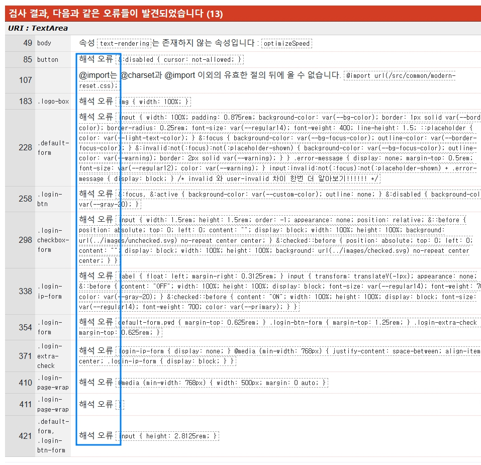

## 4주차회고

이번에도 정신없이 흘러간 한 주이지 싶다.  
**확실히 점점 더 나은 내가 되어가고 있음을 느끼는 기분!?😉**

전역변수에서 나아가 똑똑하게 지역변수를 사용할 수 있으면 좋을 것 같단 생각이 든다.

사실 css nesting을 이번 부트캠프하면서 사용할 수 있게 되었는데 넘 편리하고 좋은 것 같다

```css
/* 기존에 사용하던 방법 */
.banner-content-wrap > .banner-lists > .banner-item {
}
div.profile-box-wrap p.profile-text {
}

/* 알게된 방법💡 */
.banner-content-wrap {
  .banner-lists {
    .banner-item {
    }
  }
}
```

확실히 아는게 힘이다!💪  
무분별한 네스팅이 아니라 적절한 네스팅 활용을 통해 코드 관리를 더욱 잘해볼 수 있도록해야지!!!!!!🔥

> 📖 로그인 과제 이후 유효성 검사를 했는데 nesting과 관련된 항목들이 해석오류로 오류가 발생하였다.
> nesting 관련한 부분은 아직 못 읽어들이는걸까.....😭😭
>
> 
